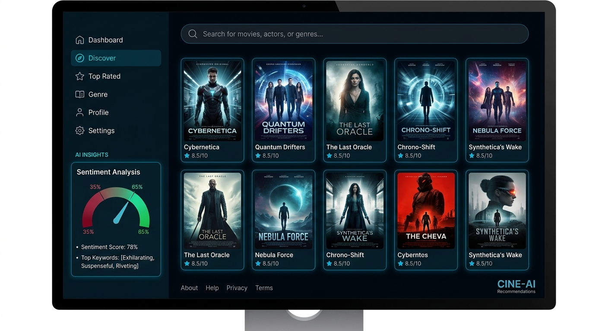

# 🎬 CineMind

CineMind is a **plug-and-play Streamlit movie dashboard** with a sleek **Netflix-style dark UI**, **AI-powered sentiment analysis**, and an **instant recommendation engine** powered by an internal built-in movie dataset.

No CSV downloads. No external data setup. Just run the app and enjoy the experience immediately.

---

## ✨ Features

- **Integrated Dataset**  
  A built-in synthetic dataset of **20 popular movies** is embedded directly in `app.py`.

- **AI Sentiment Analysis**  
  Users can type a movie review and CineMind analyzes the sentiment using **TextBlob**.

- **Genre-Based Recommendations**  
  Select a genre and get instant movie suggestions from the internal dataset.

- **Modern Netflix-Style UI**  
  A polished **dark mode interface** with custom CSS, cinematic cards, sidebar, and hero banner styling.

- **Plug and Play Setup**  
  The app includes a lightweight **auto-install check** for missing Python libraries.

- **Branding Ready**  
  Supports your local `banner.png` and `logo.png` files automatically when placed in the same directory as `app.py`.

---

## 📁 Project Structure

```bash
CineMind/
│
├── app.py
├── README.md
├── banner.png   # optional - your custom banner
└── logo.png     # optional - your custom logo
```

---

## 🚀 How to Run

### 1) Clone the repository

```bash
git clone https://github.com/your-username/CineMind.git
cd CineMind
```

### 2) (Optional but recommended) Create a virtual environment

**Windows**
```bash
python -m venv venv
venv\Scripts\activate
```

**macOS / Linux**
```bash
python3 -m venv venv
source venv/bin/activate
```

### 3) Run the Streamlit app

```bash
streamlit run app.py
```

> If `streamlit` or `textblob` is missing, the app will attempt to install them automatically.

---

## 🧠 Core Modules

### Recommendation Engine
CineMind filters the internal movie dataset by genre and displays matching titles as recommendations.

### Sentiment Analyzer
The review analyzer uses **TextBlob** polarity scoring to classify user reviews as:
- **Positive**
- **Neutral**
- **Negative**

### Embedded Movie Dataset
The app ships with an internal list of movie records, each containing:
- **Title**
- **Genre**
- **Description**

---

## 🎨 Branding Assets

To enable full branding, place your files in the same folder as `app.py`:

- `banner.png`
- `logo.png`

If these files are not found, CineMind still runs perfectly with graceful visual fallbacks.

---

## 📸 Screenshot Placeholders

### 📸 Project Preview

#### 🏠 Dashboard UI & Features


#### 🧠 AI Sentiment & Vision


---

## 🛠 Tech Stack

- **Python**
- **Streamlit**
- **TextBlob**
- **Custom CSS**

---

## 💡 Future Ideas

- Add poster thumbnails for each movie
- Expand the internal dataset with ratings and release years
- Support multi-genre filtering
- Add trending / featured movie sections
- Save review history and analytics

---

## 📄 License

This project is open-source and can be released under the **MIT License**.

---

## 🤝 Contributing

Pull requests, UI improvements, and feature suggestions are welcome.

If you build on CineMind, consider adding:
- richer movie metadata
- collaborative filtering
- advanced NLP sentiment models
- deployment support for Streamlit Community Cloud

---

## ⭐ Show Some Love

If you like this project, give it a star on GitHub and share it with fellow movie lovers.
